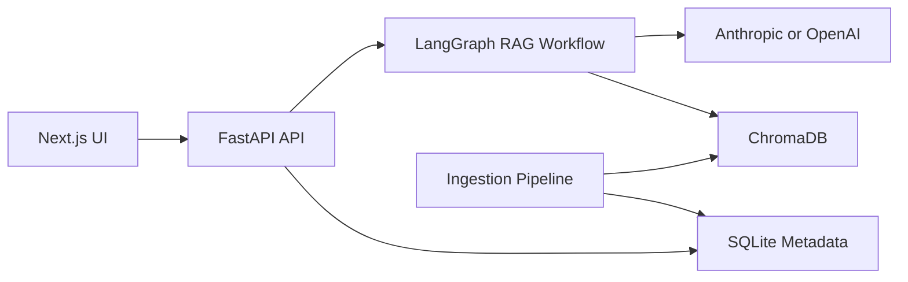

# VeriDoc RAG Assistant

VeriDoc is a local-first technical documentation assistant that combines FastAPI, LangGraph, ChromaDB, and a polished Next.js UI to answer questions with citations and observable self-correction traces.

## Quickstart

### Backend

```bash
cd backend
python3.11 -m venv .venv
source .venv/bin/activate
pip install -r requirements-dev.txt
cp .env.example .env  # Fill in ANTHROPIC_API_KEY
python scripts/ingest_corpus.py
uvicorn app.main:app --reload
```

On Windows PowerShell, activate the virtual environment with:

```powershell
cd backend
python -m venv .venv
.\.venv\Scripts\Activate.ps1
pip install -r requirements-dev.txt
Copy-Item .env.example .env
uvicorn app.main:app --reload
```

All backend commands must be run after activating `backend/.venv`.

### Frontend

```bash
cd frontend
pnpm install
pnpm dev
```

## Architecture



## Screenshots

Screenshots will be added during the final documentation phase.

## Tech Stack

- Backend: FastAPI, LangGraph, LangChain, ChromaDB, SQLite, Pydantic v2, structlog
- Frontend: Next.js 14, React 18, TypeScript, Tailwind CSS, shadcn/ui
- Testing and quality: pytest, pytest-asyncio, ruff, mypy, Vitest, Playwright

## Project Structure

```text
rag-docs-assistant/
├── backend/
│   ├── app/
│   ├── scripts/
│   ├── tests/
│   ├── requirements.txt
│   ├── requirements-dev.txt
│   └── pyproject.toml
├── frontend/
├── corpus/
├── docs/
├── scripts/
└── README.md
```

## Documentation

- [Architecture](docs/ARCHITECTURE.md)
- [Decisions](docs/DECISIONS.md)
- [API Reference](docs/API.md)

